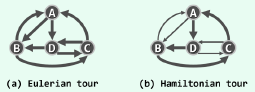

# 图 (graph)
### 图和边
#### 图
G = (V, E), 
集合V中的元素称为`顶点(vertex)`；集合E中的元素分别对应V中的某一顶点(u, v)来表示他们之间的某种关系，称为`边(edge)`。  

#### 边
若(u, v)所对应的顶点u，v之间的次序无所谓，称为`无向边(undirected edge)`，反之称为`有向边(directed edge)`。  

无向边(u, v) 亦可记作 (v, u)  
有向边(u ,v) 和 (v, u)不可混淆。 约定有向边(u, v)从 u 指向 v， 其中u是边的起点(origin) / 尾顶点(tail); v是边的终点(destination) / 头顶点(head)。

#### 图的种类
+ 无向图  
各边均无向，称为无向图(undirected graph)
+ 有向图  
各边均有向，称为有向图(directed graph)
+ 混合图
有向边，无向边同时存在，称为混合图(mixed graph)

#### 度
##### 邻接(adjacent)
对于任意边e = (u, v)，称顶点u 与 v邻接 | 互为邻居，且它们都与边e彼此`关联(incident)`。
##### 入边(outgoing edge) / 出边(incoming edge) 
对于有向边e = (u, v)，e 被称为 `u的出边`，`v的入边`。
##### 无向边的点的度(degree)
在无向边e = (u, v)中，与顶点v关联的边数称为V的度(degree)，记作deg(v)。
##### 有向边的点的度(degree)
对于有向边e = (u, v)：
+ v的出边总数为出度(out-degree) 记作: outdeg(v)
+ u的入边总数为入度(in-degree) 记作：indeg(v)

### 简单图(simple graph)
连接同一顶点的边称为自环(self-loop)。
不含任何自环的图称为简单图。

#### 通路(path)
图中一条边依次首尾相接的路径称为一条通路。对于沿途边总数为m的通路，其长度表示为|π| = m。
#### 环路(cycle)
若图中某一通路的起点和终点位于同一顶点，则该通路被称为环路。
#### 有向无环图(directed acyclic graph, DAG)
不含任何环路的有向图称为有向无环图
#### 简单环路(simple cycle)
环路中除首尾顶点各个顶点互异的环路称为简单环路
#### 欧拉环路(Eulerian tour)
在环路中经过图中各边一次且恰好一次的环路称为欧拉环路。长度为图中边的总数e。实例图中{C, A, B, A, D, C, D, B, C}
#### 哈密尔顿环路(Hamiltonian tour)
在环路中经过图中各顶点一次且恰好一次的环路称为汉密尔顿环路。长度依旧为构成环路的边数e。示例图中{C, A, D, B, C}

### 带权网络
各边指定了相应权重的图 带权图 (weighted graph)

## 复杂度
无向图中，对于n个顶点，边的总数不超过n(n-1)/2条
有向图中不超过n(n-1)条
复杂度为*O*(n2)

## 数据结构实现
[邻接矩阵(adjacency matrix)](./邻接矩阵)

## 图的遍历
[图遍历(traversal graph)](../算法/图遍历)

