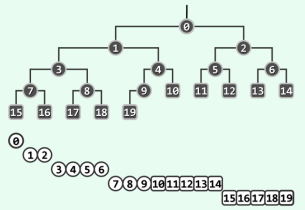

# 堆 / 优先队列  

## 完全二叉堆 (complete binary heap)  
+ 结构性：堆中任意节点的值总是不大于（不小于）其子节点的值；

+ 堆序性：堆总是一颗完全树。逻辑结构等同于完全二叉树。 

### 大顶堆 / 最大堆  

父节点的键值总是大于等于任何一个子节点的键值

### 小顶堆 / 最小堆

父节点的键值总是小于等于任何一个子节点的键值  

### 高度 
n个节点的堆的高度是 h = log2n = *O*(logn)  
insert() 和 delMax() 的操作时间复杂度将线性正比于堆的高度h，所以他们均可在 ***O*(logn)** 的时间内完成。

### 层次遍历
  
树 -> 堆 index堆应

+ 若V有左孩子，则 i( lchild( v ) ) = i( v ) << 1 + 1;
+ 若V有右孩子，则 i( rchild( v ) ) = i( v ) << 1 + 2;
+ 若V有父节点，则 i( parent( v ) ) = [ i( v ) - 1 *向下取整*] / 2 = [ i( v ) / 2 *向上取整*] - 1;

### 堆类
```js
/**
 * 最大堆
 * @param {number} m 堆的向量
 * @public
 */
function BinaryHeap(m){
    /**
    * @property {Array<number>} _heap 堆本身
    * @private
    */
    this._heap = m;

    /**
    * @property {number} _size 堆的大小
    * @private
    */
    this._size = m.length;
    
    /**
    * @property {number} top 堆中极值的那个元素
    * @public
    */
    this.top = this._heap[0] || '';
 }
```

### 父亲和两个孩子中最大的元素
```js
/**
 * 返回父亲和两个儿子中最大的元素的秩
 * @param {number} n 父亲的秩
 * @param {number} v 父亲的值 
 * @param {number} end 长度
 * @return {number} 最大元素的秩
 * @public
 */
BinaryHeap.prototype.ProperParent = function(n, v, end){
    /**
    * @property {number} left n的左孩子的秩
    * @property {number} right n的右孩子的秩
    * @property {number} mid n的左右孩子中较大元素的秩
    */ 
   const {_heap} = this;
   const top = end || this._size;
   if(n >= top){
       return null;
   }
   const left = (n << 1) + 1;
   const right = (n << 1) + 2;
   const mid = left < top ?  //判断左孩子是否存在，若左孩子不存在则右孩子肯定也不存在
       (right < top ? 
           (_heap[left] > _heap[right] ? //返回左右孩子中大的那个
               left : right) 
           : left )
       : n;
   return v >= _heap[mid] ? n : mid;
}
```

### 插入
在插入中，为了保证堆整体的偏序，需要将插入元素整体插入到相应位置。先增加后上滤。
```js
/**
 * 增加一个元素并保证堆偏序
 * @param {number} n 插入的元素 n
 * @public
 */
BinaryHeap.prototype.insert = function(n){
    let {_heap} = this;
    _heap.push(n);
    this._size++;
    console.log(n);
    this.percolateUp(this._size - 1)
}
```
#### 上滤
```js
/**
 * 上滤元素
 * @param {number} n 起始的秩 n
 * @return {number} 插入位置的秩
 * @private
 */
BinaryHeap.prototype.percolateUp = function(n){
    /**
     * @property {number} insertRank 插入位置的秩
     * @property {number} insertValue 插入位置的值 
     * @property {number} parent 插入位置的父元素的秩
     */ 
     console.log('n',n);
    let insertValue = this._heap[n]
    let insertRank = n;
    let parent = ((insertRank + 1) >> 1) - 1;
    while(parent >= 0){
        if(this._heap[parent] >= insertValue) {
            break;
        }
        this._heap[insertRank] = this._heap[parent];
        insertRank = parent;
        parent = ((insertRank + 1) >> 1) - 1;
    }
    this._heap[insertRank] = insertValue;
    return insertRank;
}
```

### 删除
在弹出顶部最大/最小元素后，仍保持堆顶最大。先弹出后下滤。
```js
/**
 * 弹出堆中极值的那个元素
 * @return {number} 堆中极值的那个元素
 * @public
 */
BinaryHeap.prototype.delMax = function(){
    /**
     * @property {number} max || min 堆中极值的那个元素
     */ 
    const {_heap} = this;
    const max = _heap[0];
    _heap[0] = _heap[--this._size];
    this.percolateDown(0);
    this._heap.pop();
    return max
}
```
#### 下滤
从起始点开始父元素不断和两个子元素中较大的且大于父元素的子元素交换，直到父元素大于两个子元素
```js
/**
 * 下滤
 * @param {number} i 下滤起始秩
 * @param {number} e 下滤的终点
 * @return {number} 下滤的终点的秩 
 * @private
 */
BinaryHeap.prototype.percolateDown = function(i, e){
    /**
     * @property {number} parent 插入位置的父元素的秩
     * @property {number} insert 待排序的值
     * @property {number} bigger 父亲和他的孩子中值最大的秩
     */ 
    const insert = this._heap[i];
    const end = e || this._size;
    let parent = i; 
    let bigger = this.ProperParent(parent, insert, e);
    while(parent !== bigger && bigger < end){
        this._heap[parent] = this._heap[bigger];
        parent = bigger;
        bigger = this.ProperParent(parent, insert, e);
    }
    this._heap[parent] = insert;
    return parent
}
```
### 建堆
将一个向量快速变成一个堆 时间复杂度*O*(n)
#### Floyd 算法
```js
/**
 * 将输入数组变成一个二叉堆
 * @public
 */
BinaryHeap.prototype.heapify = function(){
    /**
     * @property {number} parent 向量中最后一个父元素
     */ 
    const {_size} = this;
    let parent = ((_size) >> 1) - 1;
    for ( parent; parent < _size && parent > -1; parent-- ) //自底而上，依次
        {
            this.percolateDown ( parent ); //下滤各内部节点
        }
}
```
### 堆排序
就地堆排序，有点像插入排序
```js
/**
 * 就地堆排序 
 */
BinaryHeap.prototype.inplaceHeapsort = function() {
    this.heapify(); //保证堆化
    let m = 0;
    for (let i = this._size - 1; i > 0; i--){  //从数组最后一个元素开始
        m = this._heap[i];
        this._heap[i] = this._heap[0];
        this._heap[0] = m; //交换未排序部分第一个和最后一个元素
        this.percolateDown(0 , i);  //将未排序部分下滤
        console.log(this._heap);
    }
}
```

11.55v 95.8wh replace with space 853294-855
ct: 6FSTH06TZ545L5  MFG 2016/12