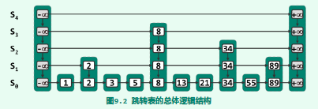

# 跳转表
设计并引入跳转表(skip list)结构的初衷，正是在于试图找到另外一种简便直观的方式，来完成这一任务。具体地，跳转表是一种高效的词典结构，它的定义与实现完全基于有序列表结构，其查询和维护操作在平均的意义下均仅需O(logn)时间。

## 跳转表结构


每一水平列表称作一层（level），其中S0和Sh分别称作底层（bottom）和顶层（top）。
与通常的列表一样，同层节点之间可定义前驱与后继关系。为便于查找，同层节点都按关键码排
序。需再次强调的是，这里的次序只是内部的一种约定；对外部而言，各词条之间仍然只需支持
判等操作即可。为简化算法实现，每层列表都设有头、尾哨兵节点。
层次不同的节点可能沿纵向组成塔（tower），同一塔内的节点以高度为序也可定义前驱与
后继关系。塔与词典中的词条一一对应。尽管塔内的节点相互重复，但正如随后将要看到的，这
种重复不仅可以加速查找，而且只要策略得当，也不至造成空间的实质浪费。
高层列表总是低层列表的子集，其中特别地，S0包含词典中的所有词条，而Sh除头、尾哨兵
外不含任何实质的词条。不难看出，跳转表的层高h必然决定于最大的塔高。

## 四联表
跳转表的一种实现，表内各个节点分别对其横向纵向都定义前驱和后继。

## 表的生长

`对于任意的0 <= k < h, Sk中任一节点在Sk+1中依然出现的概率始终为**1/2**。`
```js
// 未完成版本
const SkipListNode = function(data = {key: null, value: null}, pred = null, succ = null, above = null, below = null){
    this.data = data;
    this.succ = succ;
    this.pred = pred;
    this.above = above;
    this.below = below;
}
const List = function(pred = null, succ = null){
    this._header = new SkipListNode({key: null, value: -Infinity});
    this._tail = new SkipListNode({key:null, value: Infinity});
    this._header.succ = this._tail;
    this._tail.pred = this._header;
    this.pred = pred;
    this.succ = succ;
    this._size = 0; 
}

List.prototype.first = function (){
    return this._header.succ;
}

const SkipList = function(){
    this.leve = 0;
    this._header = new List();
    this._tail = new List();
    this._header.succ = this._tail;
    this._tail.pred = this._header;
}

SkipList.prototype.size = function(){
    return this._header.succ._size;
}

SkipList.prototype.first = function(){
    return this._header.succ;
}

SkipList.prototype.get = function(k){
    if(this.size() === 0) { return void 0 }
    let q = this.first();
    let p = q.first();
    this._skipSearch(q, p, k);
    return this._skipSearch(q, p, k) ? re.data.value : void 0; 
}

SkipList.prototype._skipSearch = function(q, p, k){
    while(true){
        while(p.succ !== q._tail && p.data.key <= k){
            p = p.succ;
        }
        p = p.pred;
        if(p.pred !== q._header && (k === p.data.key)){ return true }
        q = q.succ;
        if(q.succ === this._tail){return false}
        p = p.pred === q._header ? q.first() : p.below;
    }
}

SkipList.prototype.put = function(k, v){
    const e = new SkipListNode({key: k, value: v});
    if(this.size() === 0){
        const newL = new List(this._header, this._tail);
        this._header.succ = newL;
        this._tail.pred = newL;
        
    }
}
```