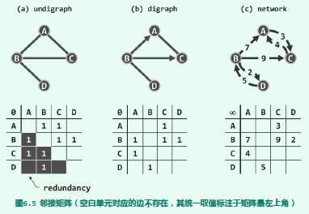
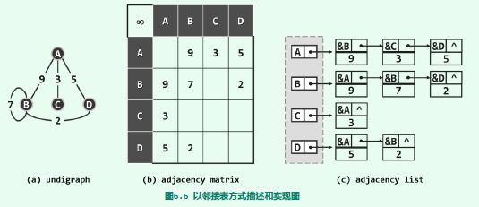

# 邻接矩阵(adjacency matrix)
使用方阵`A[n][n]`表示由n个节点构成的图。其中每个单元各自负责描述一对顶点之间可能存在的邻接关系。  
无权图中 `存在||不存在` 从顶点u到v的边，且当且仅当`A[u][v]` = 1 || 0  
带权图中矩阵中的值可从布尔值转为浮点值表示权重。 对于不存在的边，通常取值为无穷 || 0。  

使用向量实现的被称为邻接矩阵，但是空间复杂度高达n2。换之以列表的形式实现，空间复杂度大大降低。
 
## 邻接矩阵的实现
```js
const Vstatus = { UNDISCOVERED: 1, DISCOVERED:2, VISITED:3,}
const Etype = {
        UNDETERMINED: 1,
        TREE: 2,
        CROSS: 3,
        FORWARD: 4,
        BACKWARD: 5,  
    }
/**
 * 顶点对象的构造函数
 * @param {number} data 顶点数据
 * @param {Vstatus} status 顶点状态
 * @param {number} priority 顶点的优先级
 * @param {number} parent 顶点的父亲
 * @public
 */
const Vertex = function(data, status, priority, parent){
    /**
    * @props inDegree 顶点的入度
    * @props outDegree 顶点的出度
    */
    const {UNDISCOVERED, DISCOVERED, VISITED} = Vstatus;
    this.data = data || 0;
    this.status = status || UNDISCOVERED;
    this.priority = priority || Infinity;
    this.inDegree = 0;
    this.outDegree = 0;
}

/**
 * 边对象的构造函数
 * @param {number} data 边数据
 * @param {Etype} type 边类型
 * @param {number} weight 边权重
 * @public
 */
const Edge = function(data, weight, type){
    { UNDETERMINED, TREE, CROSS, FORWARD, BACKWARD } = Etype;
    this.data = data || 0;
    this.weight = weight || 0;
    this.type = type || UNDETERMINED;
}


/**
 * 图的构造函数
 * @public
 */
const Graph = function(){
    /**
     * @property {Array<Vertex>} v 顶点数组
     * @property {Array<Array<Edge>} E 边矩阵
     * @property {number} n 图中边数
     * @property {number} e 图中顶点数
     */ 
    this.v = [];
    this.E = [];
    this.n = 0;
    this.e = 0;
}

/**
 * 析构
 * @public
 */
Graph.prototype.del = function(){
    this.v = [];
    this.E = [];
    this.n = 0;
    this.e = 0;
}

//**************************顶点的操作******************************
/**
 * 顶点的插入
 * @param {Vertex} vertex 待插入的顶点
 * @return {number} 插入位置的编号
 * @public
 */
Graph.prototype.insertV = function(vertex){
    this.E.forEach(v=> v.push(null));
    this.n++;
    this.E.push(new Array(n).fill(null));\
    return this.v.push(new Vertex(data: vertex)) - 1;
}

/**
 * 顶点及其关联边的删除
 * @param {number} i 删除顶点的index
 * @return {Vertex} 被删除顶点的信息。如果输入不合法，返回-1。
 * @public
 */
Graph.prototype.removeV = function(i){
    if(i<0 || i>=this.n){
        return -1;
    }
    this.E[i].forEach((val, k)=>{
        !!v && this.v[k].inDegree--;
    })
    this.E.splice(i,1);
    this.E.forEach((val,k)=>{
        !!val[i] && this.v[k].outDegree--;
        val.splice(i,1);
    })
    const returnV = this.v[i];
    this.v.splice(i,1);
    this.n--;
    return returnV;
}

//**************************边的操作******************************
/**
 * 边是否存在
 * @param {number} i 起点
 * @param {number} j 终点
 * @return {Boolean} 是否存在
 * @public
 */
Graph.prototype.existsE(i,j){
    return 0 <= i && i < n && 0 <= j && j < n && !!this.E[i][j]
}

/**
 * 边的插入
 * @param {Edge} edge 待插入的顶点
 * @param {number} w 边的权重
 * @param {number} i 起点
 * @param {number} j 终点
 * @return {number} 插入成功与否
 * @public
 */
Graph.prototype.insertE = function(edge, w, i, j){
    if (this.existsE(i,j)){
        return 0
    }
    E[i][j] = new Edge( edge, w ); //创建新边
    e++; 
    V[i].outDegree++; 
    V[j].inDegree++; //更新边计数不关联顶点癿度数
}

/**
 * 边的删除
 * @param {number} i 起点
 * @param {number} j 终点
 * @return {Edge} 被删除顶点的信息
 * @public
 */
Graph.prototype.removeE = function(i, j){
    const returnE = this.E[i][j];
    this.E[i][j] = null;
    V[i].outDegree++; 
    V[j].inDegree++; //更新边计数不关联顶点癿度数
    this.e--;
    return returnE;
    }
```