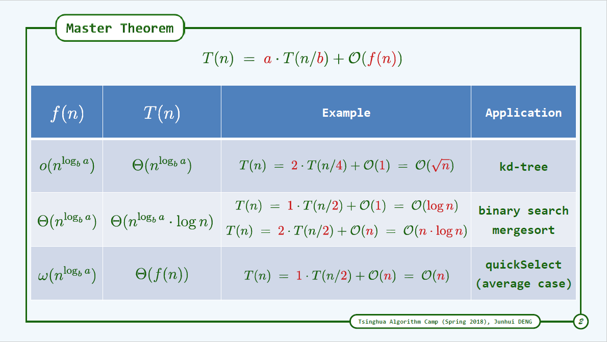

# 分而治之 (divide and conquer)
## master theorem 大师定理
递归递推式: T(n) = a * T(n/b) + O(f(n))

*o* -- small-o  
T(n) = *O*(f(n))
可以视作f(n)是T(n)常数倍的上界 T(n) <= f(n)
而当T(n) = *o*(f(n))
T(n) < f(n)

### 总和最大区间 Greatest Slice
[实现](./greatestSlice)

### 乘法 multiplication: native + DAC
[实现](./乘法)

### 归并排序 Mergesort
求逆序对

### linearSelect
### diameter of binary tree
### closest pair